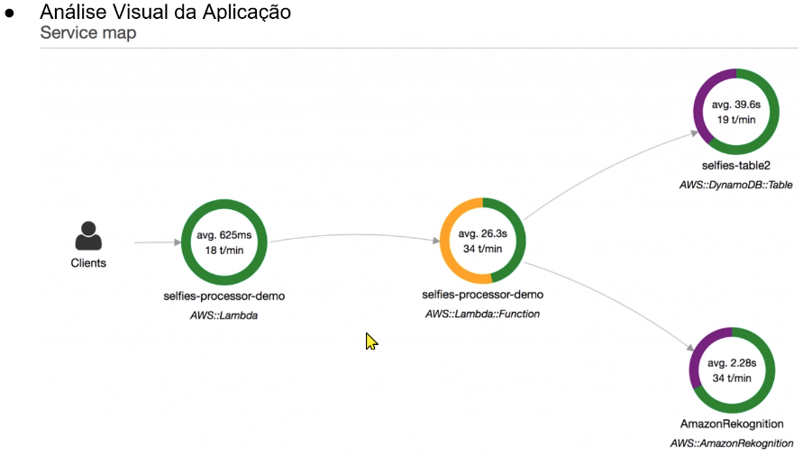
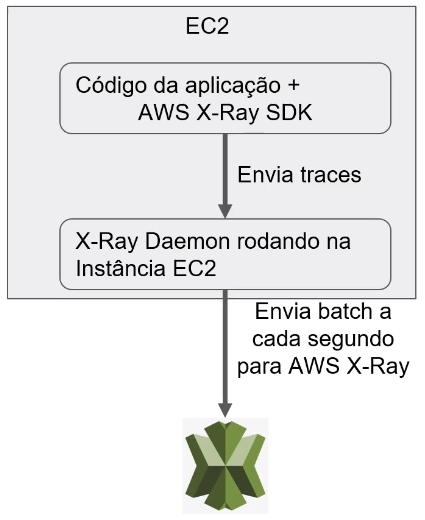

# X-Ray

- Debugging em Produção:
    - Teste localmente
    - Adiciona log statements em todos os lugares
    - Re-deploy em produção
- Formato dos logs é diferente entre as plataformas usando CloudWatch (difícil de fazer análise)
- Debugging
- Sem visão comum de toda a arquitetura
- X-Ray coleta dados de vários serviços
- Service Map utiliza Segments e Traces
- X-Ray é gráfico, fácil entendimento

### Vantagens

- Troubleshooting Performace (Gargalo)
- Entendendo dependencies em arquitetura microservice
- Identificar Problemas com Pinpoint Service
- Revisar comportamento das requisições
- Encontrar erros e exceções
- Identificar usuários impactados

### Compatibilidade

- AWS Lambda
- Elatic BeanStalk
- ECS
- ELB
- API Gateway
- Instância EC2 ou qualquer outro servidor, inclusive on premise

### Utiliza Trancing

- Trancing é uma forma de monitorar um Request de um ponto ao outro
- Cada componente que trata um Request adiciona seu próprio Trace
- Trace é feito de segmentos (mais sub segmentos)
- Annotations pode adicionar Traces para incluir infomações extras
- Capacidade Trace:
    - A cada Request
    - Sample Request (Exemplo: porcentagem ou taxa por minuto)
- Segurança X-Ray:
    - Autorização IAM
    - KMS para criptografia em repouso

### Como Habilitar

- No seu código (Java, Python, Go, Node.js entre outros) deve-se importar AWS X-Ray SDK
    - Pouca alteração no código
    - O SDK da aplicação caputra:
        - Calls para Serviços AWS
        - Request HTTP/HTTPS
        - Database Calls (MySQL, PostgreSQL, DynamoDB)
        - Queue Calls (SQL)

- Instalando X-Ray daemon ou habilitando X-Ray AWS Integration
    - X-Ray daemon funciona como baixo nível UDP packet interceptor (Linux, Windows, Mac)
    - AWS Lambda e outros serviços AWS que já rodam X-Ray daemon
    - Cada aplicação deve ter permissão IAM para escrever dados no X-Ray

### Troubleshooting

- Se X-Ray não estiver funcionando na instância EC2
    - Verifique se EC2 IAM Role tem a correta permissão
    - Verifique se EC2 está rodando X-Ray Daemon
- Habilitar AWS Lambda:
    - Verifique se tem IAM execution role com Policy correta (AWSX-RayWriteOnlyAccess)
    - Verifique se X-Ray foi importado no código
