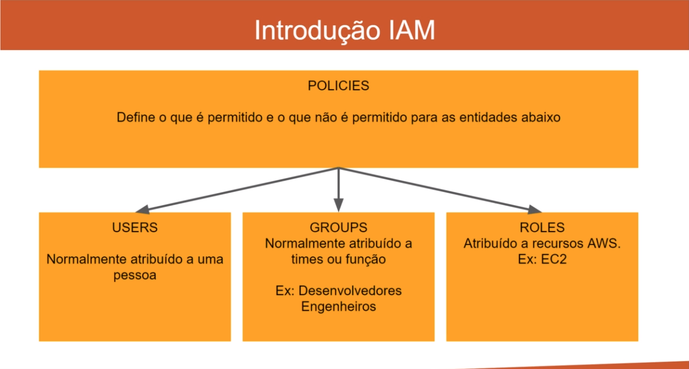

# AWS

[S3 (Simple Storage Service)](./S3/README.md)

[Cloud Watch](./CloudWatch/README.md)

[Lambda](https://www.notion.so/Lambda-2ccaf033722b40cf937e8fb993ab3f17)

[EC2](https://www.notion.so/EC2-641ac5e49fea43e181fc06a3df2dea11)

[Route 53](https://www.notion.so/Route-53-3ecb34c922504174afdb693255aefd69)

[RDS](https://www.notion.so/RDS-52e198f13000416eb2da6bc82a3d4b53)

[ElastiCache](https://www.notion.so/ElastiCache-eb6675e67ce34d768ef73ca03e04f2a1)

[Elastic BeanStalk](https://www.notion.so/Elastic-BeanStalk-85ef156084834fdfb7699b88321ba282)

[CICD Continuous Integration / Delivery (Item obrigatório para certificação Desenvolvedor AWS)](https://www.notion.so/CICD-Continuous-Integration-Delivery-Item-obrigat-rio-para-certifica-o-Desenvolvedor-AWS-7d9b18a341f2443c8f77d525061e3320)

[CloudFormation](https://www.notion.so/CloudFormation-66c73079dccd4fb4b867580b64f30a9d)

[SQS (Simple Queue Service)](https://www.notion.so/SQS-Simple-Queue-Service-b56ce29050dc4988925cc00e755511f6)

### Informações Gerais

Sobre região

- Os servidores da aws são espalhados por cidade Regiões: us-east-1
- Em cada cidade devesse existir mais de um servidor, conhecidos como Zona: us-east-1a, us-east-2b.
- Isso acontece devido ao fato de, se algum servidor vir a acontecer alguma catastrofe o outro servidor na mesma zona, passa a comportar os dados que estava sendo processado.
- Todos os serviços da AWS são necessários especificar qual a região para ser usado, exceto o IAM e S3, que são serviços globais.

### IAM (Definition Access Manage)

Antes de começar a fazer qualquer coisa na AWS primeiro você ira precisar configurar o IAM.

- MFA(Multi Factor Authentication) pode ser configurada.
- Todas as polices são configuradas por arquivos JSON.
- IAM tem Polices pré definidas (managed polices) para facilitar.
