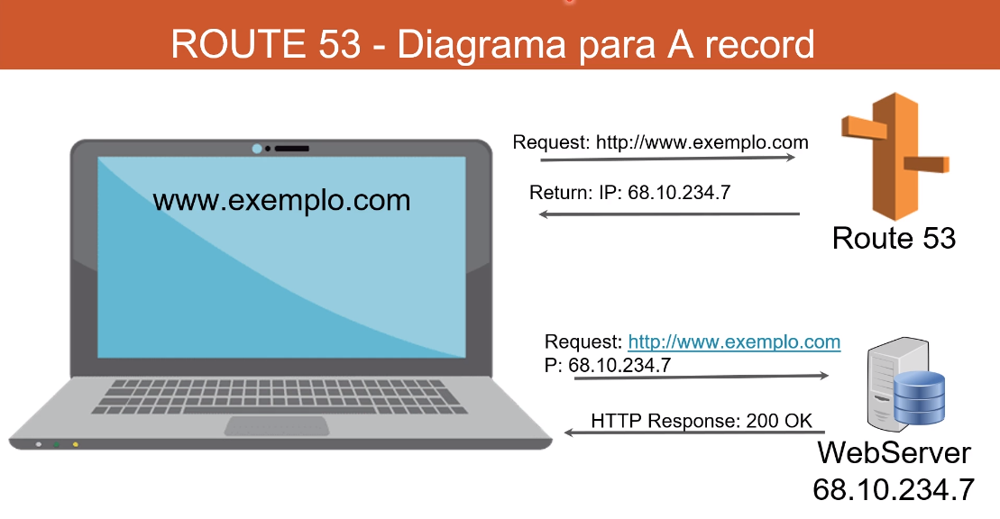

# Route 53

### AWS - ROUTE 53

- Route 53 é um DNS (Domain Name System) gerenciado pela AWS
- DNS é uma coleção de Registros(Records) e Regras (Rules) que auxiliam o cliente a encontrar o servidor desejado utilizando uma URL(Universal Resource Locator)
- Na AWS os Records mais comuns são:
    - A: URL para IPv4
    - AAAA: URL para IPv6
    - CName: URL para URL
    - ALIAS: URL para Recursos AWS
    - Use Alias para recursos AWS ao invés de CNAME

